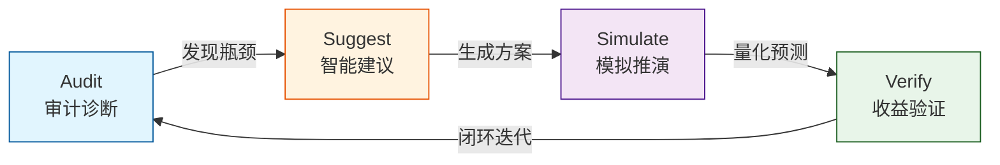
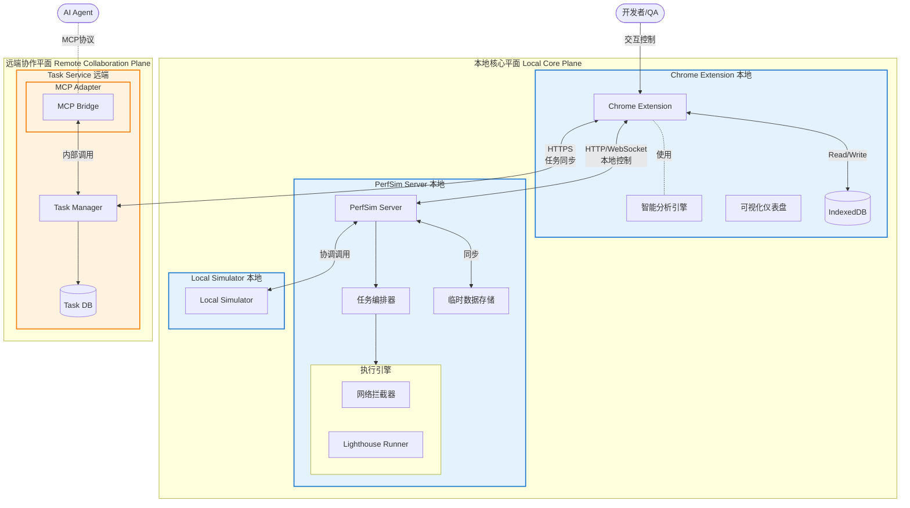
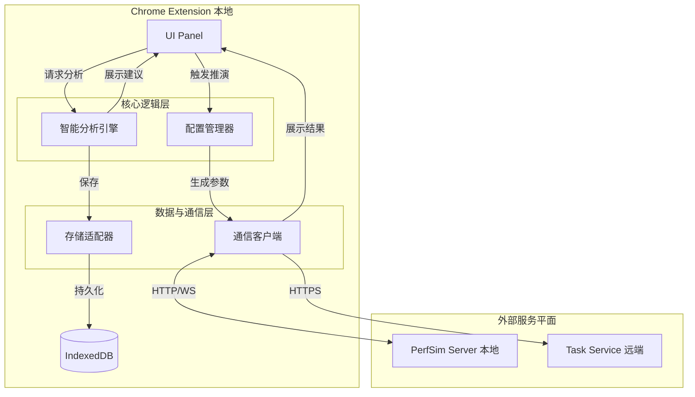
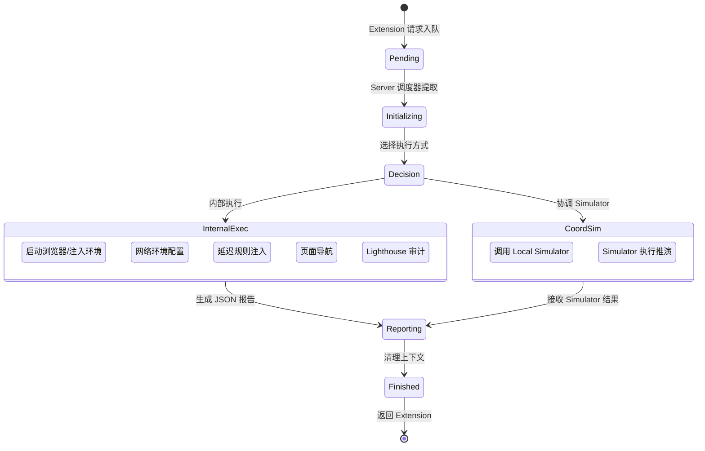
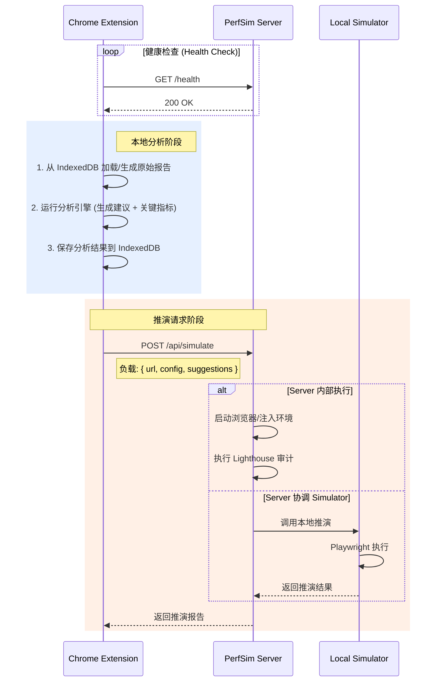
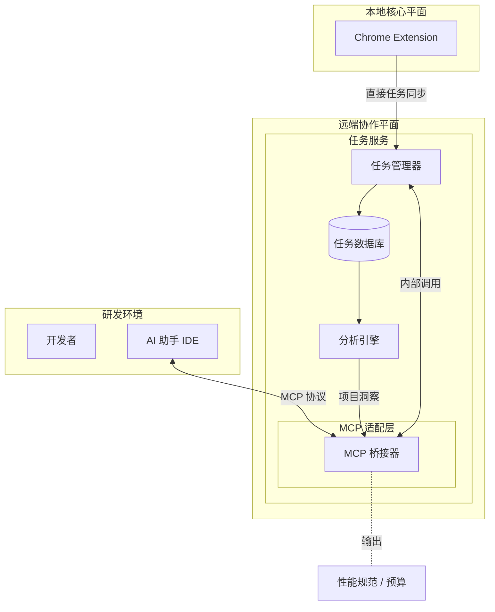
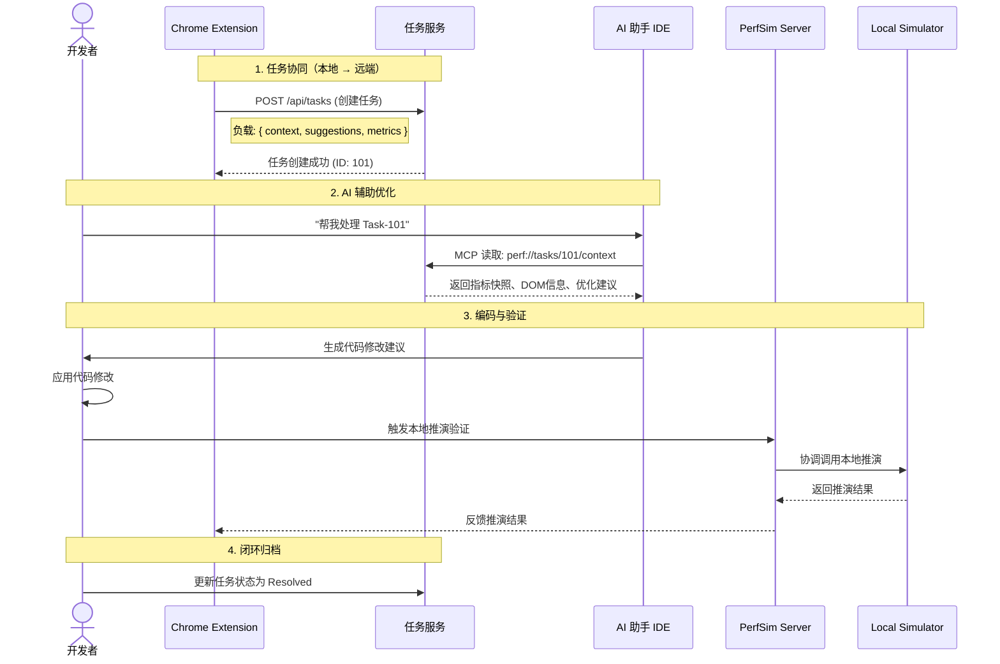
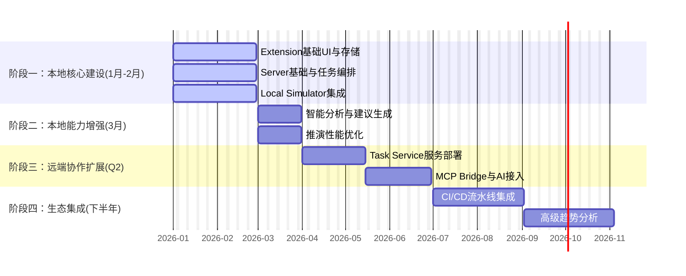

# 1. 产品愿景与核心理念 (Vision & Core Concepts)

## 1.1 产品定义：推演驱动的性能工程平台

**PerfSim Platform** 是一款**推演驱动 (Simulation-Driven)** 的前端性能工程平台，旨在将性能优化从传统的“事后监控”前置为“开发期验证”。

平台不仅仅是一个调试工具，更是开发者&#x7684;**“性能风洞实验室”**。它深度整合了**智能分析引擎**与**真实环境推演内核**，为开发者提供了一套从**自动诊断**、**智能建议**、**模拟推演**到**收益验证**的完整闭环工具链。

## 1.2 核心价值主张

1. **拒绝估算，真实推演 (Simulation-Driven)**：利用内置的 Playwright 执行引擎和环境模拟器（弱网、CPU 节流），在代码提交前精准预测 LCP、INP 等关键指标的变化，量化优化的 ROI。

2. **本地优先，数据安全 (Local-First)**：核心能力运行在本地环境，确保数据隐私、离线可用性和即时反馈，同时通过远端层提供协作扩展。

3) **智能协作，资产沉淀 (MCP-Enabled)**：通过 **MCP (Model Context Protocol)** 无缝接入 AI 能力与云端协作服务，将离散的性能调试转化为结构化的团队资产，辅助建立可持续的性能规范。

## 1.3 双核驱动闭环

平台采用"双核驱动"架构，打通性能优化的全链路：

# 2. 系统架构设计 (System Architecture)

## 2.1 架构设计原则

* **本地优先 (Local-First)**: 核心交互与推演在本地完成，数据优先存储于客户端 IndexedDB。

* **关注点分离 (SoC)**: 交互层专注可视化，执行层专注模拟，协作层专注信息共享。

* **双通道通信 (Dual Channels)**: Chrome Extension 与 PerfSim Server 通信进行本地执行，直接与 Task Service 通信进行任务同步。

* **协议解耦**: 通过 MCP (Model Context Protocol) 实现远端 AI 能力的标准化接入。

## 2.2 架构分层全景图

平台架构分为两个核心平面：**本地核心平面**（隐私与速度）与**远端协作平面**（共享与智能）。

## 2.3 模块职责定义

<table><colgroup><col width="80"><col width="158"><col width="395"><col width="189"></colgroup>
<thead>
<tr>
<th>所属平面</th>
<th>模块 (Module)</th>
<th>核心职责 (Core Responsibilities)</th>
<th>交互与备注</th>
</tr>
</thead>
<tbody>
<tr>
<td rowspan="3">本地核心</td>
<td>Chrome Extension (交互分析)</td>
<td><ol>
<li>Data Visualization: 渲染性能图表</li>
<li>Report Analysis: 解析报告，生成诊断</li>
</ol><ol start="3">
<li>Generate Suggestions: 规则引擎生成建议</li>
</ol></td>
<td>用户交互主入口 对接 Server (本地) 与 Task Service (远端)</td>
</tr>
<tr>
<td>PerfSim Server (执行协调)</td>
<td><ol>
<li>Task Orchestration: 管理任务队列</li>
<li>Browser Mgmt: 管理 Chrome 实例生命周期</li>
</ol><ol start="3">
<li>Coord Simulator: 调度底层推演引擎</li>
</ol></td>
<td>本地单实例服务 Extension 与推演引擎的中间层</td>
</tr>
<tr>
<td>Local Simulator (底层推演)</td>
<td><ol>
<li>Env Simulation: 模拟弱网、CPU 降频</li>
<li>Execute PW: 执行 Playwright 真实渲染</li>
</ol></td>
<td>专注底层执行 无外部依赖，确保可复现</td>
</tr>
<tr>
<td rowspan="2">远端协作</td>
<td>Task Service (任务协作)</td>
<td><ol>
<li>Task Management: 管理优化任务</li>
<li>Context Storage: 存储 DOM 快照、指标</li>
</ol><ol start="3">
<li>State Transition: 任务生命周期管理</li>
</ol></td>
<td>远端信息中枢 包含 MCP Bridge</td>
</tr>
<tr>
<td>MCP Bridge (AI 接入)</td>
<td><ol>
<li>Expose Resources: 暴露任务为 perf://tasks/...</li>
<li>Protocol Translation: MCP 转内部调用</li>
</ol></td>
<td>Task Service 内部组件 AI Agent 通过标准协议接入</td>
</tr>
</tbody>
</table>

# 3. 核心子系统深度解析 (Core Subsystems)

## 3.1 交互分析平面：智能建议引擎

**Chrome Extension** 是平台的"驾驶舱"。其核心组件 **Analyzer** 不仅负责渲染报告，更是**生产建议**的工厂，将枯燥的数据转化为可行动的洞察。

## 3.2 执行与编排引擎：本地闭环

**PerfSim Server** 采用**串行单实例**模型，作为本地协调中心，确保性能测试环境的纯净与稳定。

## 3.3 本地通信与数据流

Chrome Extension 仅与 PerfSim Server 通信，所有底层数据交互均通过 Server 统一协调，确保逻辑统一。

## 3.4 协作与 AI 平面：MCP 赋能

**Task Service** 引入了 **MCP Bridge**，将优化任务转化为 AI 可读写的标准资源。AI 不再是外部的旁观者，而是通过 MCP 协议直接参与到任务的分析与解决中。

# 4. 关键业务流程 (Key Workflows)

## 4.1 本地开发闭环 (Local Core Loop)

无需网络依赖，单兵作战时的性能调试流：

1. **性能审计与分析**: 触发审计 -> 智能分析 -> 生成建议 -> 本地存储。

2. **推演请求**: 选择建议 -> 配置推演参数 -> 发送至 Server。

3) **结果展示**: 接收推演报告 -> 生成 Diff 视图 -> 验证收益。

## 4.2 团队协作与 AI 工作流 (Team & AI Collaboration)

基于 MCP 实现“人-AI”深度协作：

## 4.3 生态演进：从个案到规范

Task Service 聚合历史数据，AI 充当“性能架构师”：

1. **聚合分析**: 识别高频问题（如“图片未优化”、“主线程阻塞”）。

2. **生成报告**: AI 生成“项目健康度报告”。

3) **提议规范**: AI 建议更新 `performance-budget.json` 或工程指南。

4) **团队共识**: 审查通过后，将规范合入代码仓库，形成新的基线。

# 5. 演进路线图 (Roadmap)

